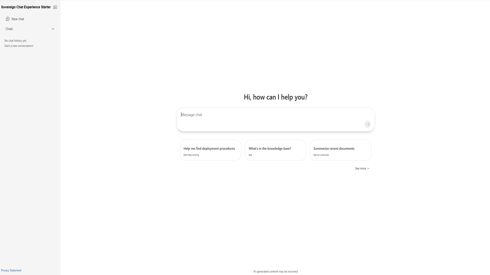

# Sovereign Chat Experience Starter

A reusable Chat UI for AI experiences, built on the Azure OpenAI Responses API standard and Fluent AI components. It connects to a MS Foundry project and is designed to be deployed on Azure Kubernetes Service (AKS) clusters. The application features a chat interface, chat history, streaming responses, and a pluggable provider architecture that supports both live MS Foundry backends and an in-memory mock mode for offline development.

Sample application code is included in this project. You can use or modify this app code or you can rip it out and include your own.

 

[**ARCHITECTURE**](#architecture) \| [**FEATURES**](#features) \| [**GETTING STARTED**](#getting-started) \| [**GUIDANCE**](#guidance)

 

>  **Note**: This template, the application code and configuration it contains, has been built to showcase Microsoft Azure specific services and tools. We strongly advise our customers not to make this code part of their production environments without implementing or enabling additional security features. For a more comprehensive list of best practices and security recommendations for Intelligent Applications, visit the [Security](#security) section.

 

## Architecture

### Architecture Diagram

 

## Features

This project framework provides the following features:

* **On-prem & hybrid ready** — a ready-to-use chat experience that can be deployed in environments where data residency, network isolation, and on-prem or hybrid execution are required.
* **Chat history & conversation management** — sidebar with create, switch, rename, and delete
* **Streaming & stop** — real-time streaming responses with cancel support
* **Pluggable provider architecture**
  * Bring your own server — the UI is decoupled from the backend, so you can point it at any API
  * Add a custom AI provider — implement the server-side provider interface to connect any API (e.g., Chat Completions, Agents, or your own)
  * Swap the frontend API layer — switch the UI to a different backend with no component changes

  See the [Quick Start Guide](docs/src/1-getting-started/quickstart.md) for details.

 

|  |
|---|

### Demo Video

[▶️  Watch the demo](docs/demo.mp4)

## Getting Started

You have a few options for getting started with this template. The quickest way to get started is [GitHub Codespaces](#github-codespaces), since it will setup all the tools for you, but you can also [set it up locally](#local-environment). You can also use a [VS Code dev container](#vs-code-dev-containers).

This template uses **gpt-4o-mini** which may not be available in all Azure regions. Check for [up-to-date region availability](https://learn.microsoft.com/azure/ai-services/openai/concepts/models#standard-deployment-model-availability) and select a region during deployment accordingly.

  * We recommend using **East US** or **Sweden Central**

 

[Click here to launch the deployment guide](./docs/src/3-deployment/quickstart-deploy.md)

 

|  |  |
|---|---|

 

> ⚠️ **Important:** To avoid unnecessary costs, remember to take down your app if it's no longer in use,
> either by deleting the resource group in the Portal or running `azd down`.

 

## Guidance

### Region Availability

This template uses **gpt-4o-mini** which may not be available in all Azure regions. Check for [up-to-date region availability](https://learn.microsoft.com/azure/ai-services/openai/concepts/models#standard-deployment-model-availability) and select a region during deployment accordingly
  * We recommend using **East US** or **Sweden Central**

### Costs

You can estimate the cost of this project's architecture with [Azure's pricing calculator](https://azure.microsoft.com/pricing/calculator/)

* [Azure Kubernetes Service enabled by Azure Arc](https://azure.microsoft.com/en-us/pricing/details/azure-arc/kubernetes-app-services-data-ai/)
* [Microsoft Foundry](https://azure.microsoft.com/pricing/details/ai-studio/)

### Security

This template has [Managed Identity](https://learn.microsoft.com/entra/identity/managed-identities-azure-resources/overview) built in to eliminate the need for developers to manage credentials. Applications can use managed identities to obtain Microsoft Entra tokens without having to manage any credentials. Additionally, we have added a [GitHub Action tool](https://github.com/microsoft/security-devops-action) that scans the infrastructure-as-code files and generates a report containing any detected issues. To ensure best practices in your repo we recommend anyone creating solutions based on our templates ensure that the [Github secret scanning](https://docs.github.com/code-security/secret-scanning/about-secret-scanning) setting is enabled in your repos.

## Resources

* [Azure OpenAI Responses API](https://learn.microsoft.com/en-us/azure/ai-foundry/openai/how-to/responses?view=foundry-classic&tabs=rest-api)
* [Getting Started Guide](docs/src/1-getting-started/quickstart.md)
* [Deployment](docs/src/3-deployment/deploy.md)
* [Custom Providers Guide](docs/src/3-deployment/custom-providers.md)
* [Microsoft Foundry documentation](https://learn.microsoft.com/azure/ai-studio/)

 

## Provide Feedback

Have questions, find a bug, or want to request a feature? [Submit a new issue](https://github.com/Azure-Samples/sovereign-chat-experience-starter/issues) on this repo and we'll connect.

 

## Disclaimers

This template provides a chat user interface that connects to AI services, including Microsoft Foundry and Azure OpenAI. The AI-generated responses surfaced through this application may include ungrounded content, meaning they are not verified by any reliable source or based on any factual data. Users of this template are responsible for determining the accuracy, validity, and suitability of any AI-generated content for their intended purposes. Users should not rely on AI-generated output as a source of truth or as a substitute for human judgment or expertise.

This release is intended as a proof of concept only, and is not a finished or polished product. It is not intended for commercial use or distribution, and is subject to change or discontinuation without notice. Any planned deployment of this release or its output should include comprehensive testing and evaluation to ensure it is fit for purpose and meets the user's requirements and expectations. Microsoft does not guarantee the quality, performance, reliability, or availability of this release or its output, and does not provide any warranty or support for it.

This Software requires the use of third-party components which are governed by separate proprietary or open-source licenses as identified below, and you must comply with the terms of each applicable license in order to use the Software. You acknowledge and agree that this license does not grant you a license or other right to use any such third-party proprietary or open-source components.

To the extent that the Software includes components or code used in or derived from Microsoft products or services, including without limitation Microsoft Azure Services (collectively, "Microsoft Products and Services"), you must also comply with the Product Terms applicable to such Microsoft Products and Services. You acknowledge and agree that the license governing the Software does not grant you a license or other right to use Microsoft Products and Services. Nothing in the license or this ReadMe file will serve to supersede, amend, terminate or modify any terms in the Product Terms for any Microsoft Products and Services.
