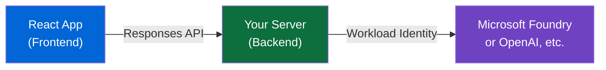
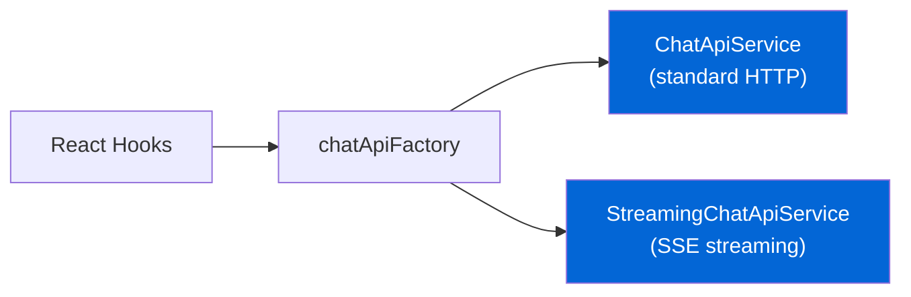
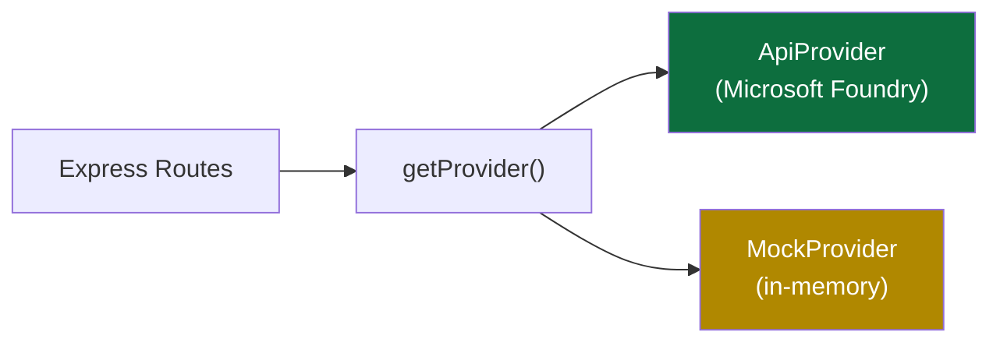
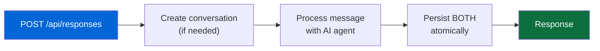
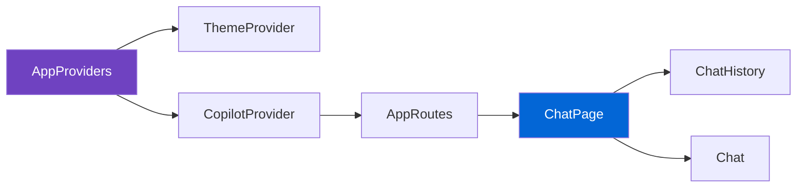

# Architecture

## System Overview

The frontend connects to **any backend** implementing the OpenAI Conversations API contract. You can use the included reference server, bring your own backend (BYOB), or implement the API contract from scratch.

## Project Structure

<LiteTree>
---
- sovereign-chat-experience-starter/
    + src/                          // Frontend React app
        components/
        config/                    // App constants + runtime env override
        context/
        hooks/
        localization/
        services/
        styles/
        types/
        utils/
        routes.tsx
        main.tsx
    + server/                       // Reference server (optional)
    + infra/                        // Bicep + K8s manifests
        + modules/
        + modes/
            k8s/
            containerapp/
    + hooks/                        // azd lifecycle hooks
    + scripts/                      // Dev utilities
    vite.config.ts
    docker-entrypoint.sh           // Runtime config injection for Docker
    Dockerfile                     // Multi-stage: Node build + nginx serve
</LiteTree>

## Pluggable Provider Pattern

Both the client and server use pluggable providers, making every layer swappable:

### Client-Side Providers

The frontend has a `chatApi` service layer with pluggable implementations:

The factory auto-detects the server mode via `GET /api/settings` and lazy-loads the matching implementation. See [services.md](/2-guide/services.md) for API details.

### Server-Side Providers

The reference server uses a `DataProvider` interface to abstract data sources:

Routes call `getProvider()` based on the `DATASOURCES` env var. See [services.md](/2-guide/services.md#server-side-dataprovider) for implementation details.

## Atomic Pattern (Responses API)

Message handling follows the **Atomic Pattern** - a single API call creates the conversation (if needed), processes the message, and persists both user and assistant messages together:

**Benefits:** Single API call, no orphan messages, refresh-safe (nothing saved mid-request), no polling or status tracking.

## API Contract

Your server must implement these endpoints:

| Method | Endpoint                       | Description                              |
| ------ | ------------------------------ | ---------------------------------------- |
| POST   | `/api/responses`               | **Send message + get response (ATOMIC)** |
| GET    | `/api/conversations`           | List all conversations                   |
| GET    | `/api/conversations/:id`       | Get conversation details                 |
| PATCH  | `/api/conversations/:id`       | Update conversation (title)              |
| DELETE | `/api/conversations/:id`       | Delete conversation                      |
| GET    | `/api/conversations/:id/items` | List messages (paginated)                |

All types come from the `openai` npm package — see [types.md](/2-guide/types.md) for type definitions and [services.md](/2-guide/services.md) for request/response examples and custom backend implementation.

## Component Architecture

Services are instantiated via factory, consumed by [hooks](/2-guide/hooks.md), and passed as props to [components](/2-guide/chat-component.md). Configuration happens at the page/hook level — the Chat component is pure presentation.

See [configuration.md](/2-guide/configuration.md) for all frontend and server environment variables.
